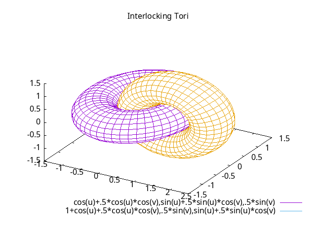
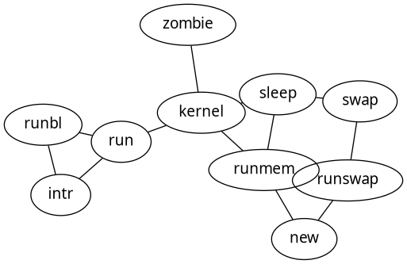
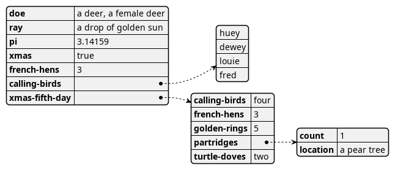
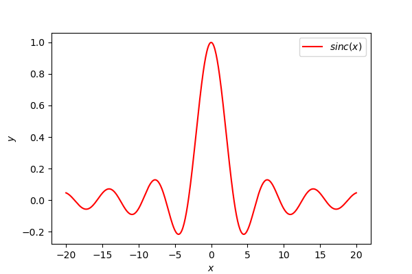

``` imagine
                                          \\\///
                                         / _  _ \
                                       (| (.)(.) |)
                .--------------------.OOOo--()--oOOO.-------------------.
                |                                                       |
                |        ____                          _                |
                |       /  _/____ ___   ____ _ ____ _ (_)____   ___     |
                |       / / / __ `__ \ / __ `// __ `// // __ \ / _ \    |
                |     _/ / / / / / / // /_/ // /_/ // // / / //  __/    |
                |    /___//_/ /_/ /_/ \__,_/ \__, //_//_/ /_/ \___/     |
                |                           /____/                      |
                |                                                       |
                '-------------------.oooO-------------------------------'
                                     (   )   Oooo.
                                      \ (    (   )
                                       \_)    ) /
                                             (_/
```

## A pandoc filter to process codeblocks

<a href="https://github.com/andros21/imagine/actions/workflows/ci.yml">
</a>
<a href="https://github.com/andros21/imagine/actions/workflows/cd.yml">
</a>
<a href="https://github.com/andros21/imagine/tags">
</a>
<br><br>

Imagine is a pandoc filter that will turn codeblocks tagged with certain
classes into images

The following class are currently supported to render code blocks in
images:

- [**Gnuplot**](#gnuplot)
- [**Graphviz**](#graphviz)
- [**Plantuml**](#plantuml)
- [**Matplotlib**](#matplotlib)

If not supported class is specified in the codeblock, by default
`imagine` it replicates the codeblock and in case `pandoc -t latex` it
converts it in a
[`minted`](https://www.overleaf.com/learn/latex/Code_Highlighting_with_minted)
codeblock (syntax highlight on!)

> [!IMPORTANT]
> Refer to [`minted`](https://ctan.org/pkg/minted)
> documentation for supported languages

> [!WARNING]
> Supported `pandoc` API versions 1.23

### Examples

#### [Gnuplot](http://www.gnuplot.info)

<figure>

</figure>

#### [Graphviz](https://graphviz.org/)

<figure>

</figure>

#### [Plantuml](https://plantuml.com/)

<figure>

</figure>

#### [Matplotlib](https://matplotlib.org/)

<figure>

</figure>
